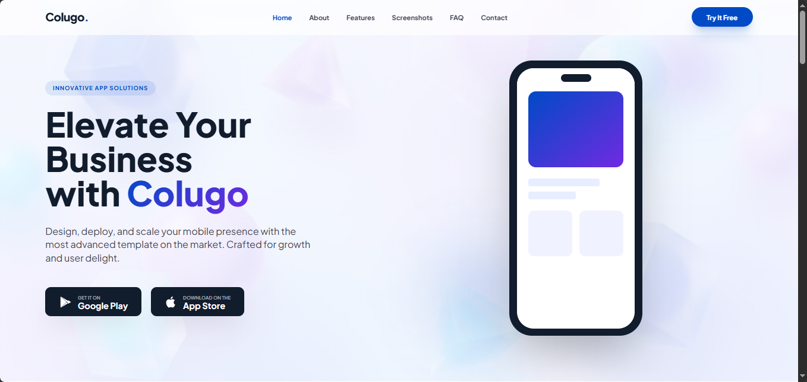
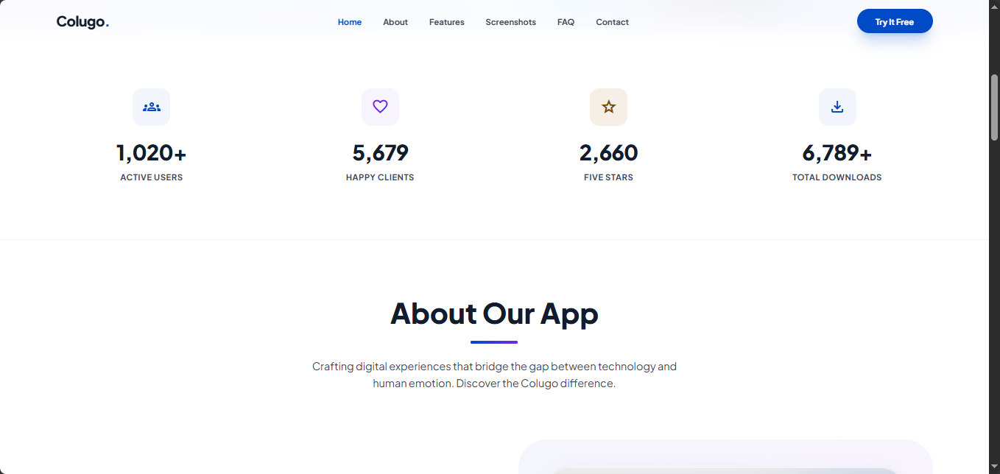
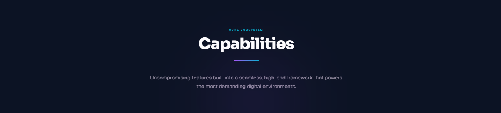
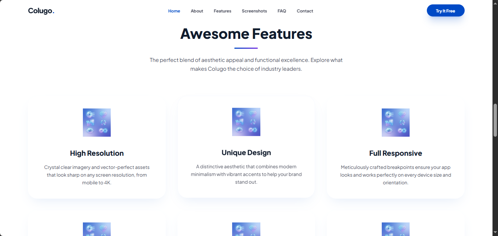
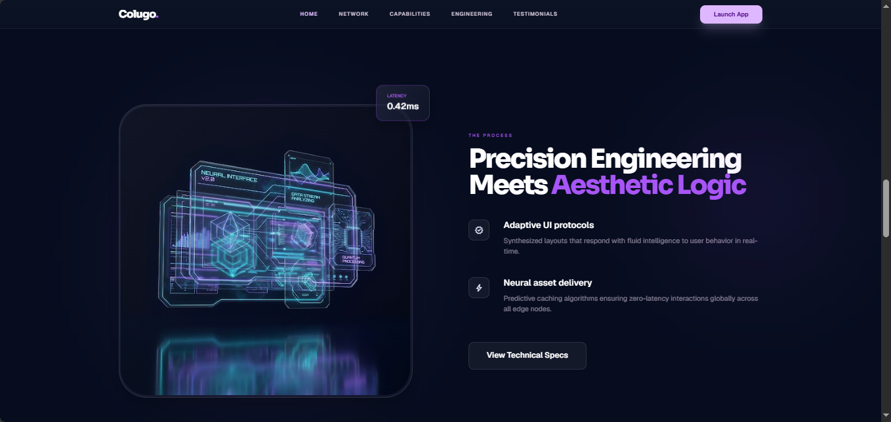
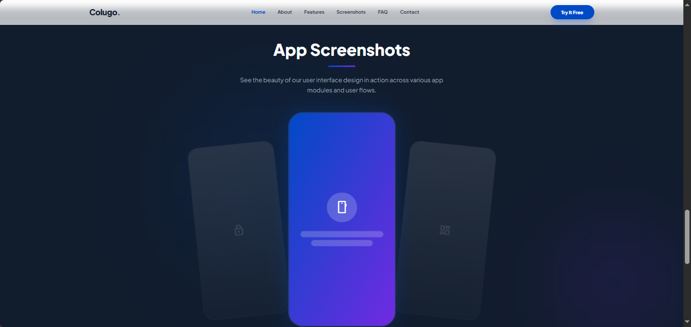
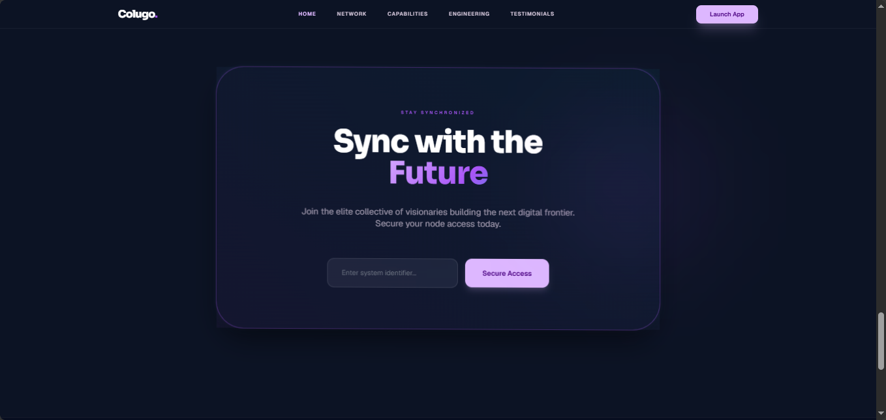

# 📋 Colugo Landing Page

<p align="center">

🌐 <a href="https://nnn1234-n.github.io/colugo-landing-page/" target="_blank">عرض الموقع المباشر</a> •
💻 <a href="https://github.com/nnn1234-n/colugo-landing-page" target="_blank">مستودع GitHub</a>

</p>

---

# 1️⃣ السياق (Context)

## 🧩 اسم المشروع
**Colugo - Premium Mobile App Landing Page**

## 📌 نوع المشروع
Landing Page احترافية لتطبيق موبايل

## 👩‍💻 الدور
Front-End Developer & UI/UX Designer

## ⏳ مدة التنفيذ
أسبوع واحد

## 📅 تاريخ الإنجاز
2026

---

## ✨ خلفية المشروع

شركة ناشئة في مجال تطبيقات الأعمال كانت بحاجة إلى وجود رقمي قوي يعكس جودة التطبيق واحترافيته بطريقة حديثة وعصرية.

ورغم أن التطبيق كان ممتازًا من الناحية التقنية، إلا أن عدم وجود Landing Page احترافية كان يؤثر بشكل مباشر على:
- جذب المستخدمين
- بناء الثقة
- زيادة معدل التحويل
- إبراز هوية المنتج

لذلك تم تطوير صفحة هبوط متكاملة تجمع بين:
- الأداء العالي
- التصميم العصري
- تجربة المستخدم الاحترافية
- الهوية البصرية الحديثة

---

# 2️⃣ المشكلة (The Problem)

## 🚨 التحديات الرئيسية

❌ معدل تحويل منخفض بسبب ضعف العرض الرقمي  
❌ عدم وجود هوية بصرية احترافية  
❌ تجربة مستخدم غير محسّنة  
❌ بطء في تحميل الصفحات  
❌ ضعف التوافق مع الأجهزة المختلفة  
❌ تصميم تقليدي لا يعكس جودة التطبيق

---

## 📊 وضع المشروع قبل التطوير

| المؤشر | القيمة |
|---|---|
| معدل التحويل | 1.2% |
| وقت التحميل | 5.3 ثانية |
| معدل الارتداد | 72% |

---

# 3️⃣ نهجي في العمل (My Approach)

---

## 📌 المرحلة 1: البحث والتحليل (اليوم الأول)

تم خلال هذه المرحلة:

- دراسة أكثر من 20 Landing Page حديثة
- تحليل المنافسين ونقاط القوة والضعف
- دراسة سلوك المستخدم
- تحليل أفضل أساليب التحويل الحديثة (CTA)

### 🎯 الهدف
فهم ما ينجح في السوق وتطبيق أفضل الممارسات داخل المشروع.

---

## 📌 المرحلة 2: التخطيط الهيكلي (Wireframing)

تم إنشاء:
- Wireframes أولية
- User Flow واضح
- توزيع بصري منظم للمحتوى
- استراتيجية CTA فعالة

### 🎯 الهدف
توفير وقت التطوير وضمان تجربة استخدام سلسة ومنظمة.

---

## 📌 المرحلة 3: التصميم والتطوير (أيام 2 - 4)

# 🛠 التقنيات المستخدمة

```txt
HTML5
Tailwind CSS
Vanilla JavaScript
Responsive Design
Google Fonts
Material Symbols
Git & GitHub
```

---

# 📐 الأقسام التي تم تطويرها

| القسم | الوظيفة |
|---|---|
| 🏠 Hero Section | عنوان جذاب + تصميم احترافي + CTA |
| 📊 Stats Counter | عرض الإحصائيات وبناء الثقة |
| ⚙️ Capabilities | عرض القدرات التقنية |
| 🎯 Precision Engineering | شرح القيمة التقنية |
| 🌟 Testimonials | تقييمات وآراء العملاء |
| 📱 App Showcase | عرض واجهات التطبيق |
| 📬 Newsletter | نموذج اشتراك بريدي |
| 🦶 Footer | روابط ومعلومات التواصل |

---

## 📌 المرحلة 4: التحسين والاختبار (اليوم الخامس)

تم تنفيذ:
- اختبار التوافق على أكثر من 10 أجهزة ومتصفحات
- تحسين سرعة التحميل
- تحسين Lighthouse Score
- تحسين SEO
- تحسين تجربة الهواتف الذكية

### 🎯 الهدف
ضمان أعلى جودة ممكنة قبل التسليم.

---

## 📌 المرحلة 5: النشر والتسليم (اليوم السادس والسابع)

تم:
- رفع المشروع على GitHub Pages
- إنشاء README احترافي
- تنظيم ملفات المشروع
- تسليم الروابط النهائية

---

# 4️⃣ الحل (The Solution)

# ✅ النتيجة النهائية

تم تطوير Landing Page احترافية بمواصفات حديثة تجمع بين:
- الأداء العالي
- الهوية البصرية القوية
- سهولة الاستخدام
- التصميم العصري

---

# 🎨 الميزات التصميمية

✅ تصميم Dark Theme عصري  
✅ Purple & Blue Gradients  
✅ Glassmorphism Effects  
✅ Hover Animations  
✅ تصميم متجاوب بالكامل  
✅ واجهات حديثة ومنظمة  
✅ تجربة مستخدم احترافية

---

# ⚡ الميزات التقنية

✅ سرعة تحميل أقل من 1.5 ثانية  
✅ بنية HTML5 دلالية محسّنة  
✅ SEO Optimized  
✅ متوافق مع معايير WCAG 2.1  
✅ Cross-Browser Compatibility  
✅ Responsive Design 100%

---

# 📦 هيكل المشروع البرمجي

```txt
project/
│
├── index.html
├── images/
└── README.md
```

---

# 🖼️ لقطات شاشة المشروع

---

## 🏠 الصفحة الرئيسية (Hero Section)



واجهة رئيسية بتصميم Dark Theme عصري تحتوي على عنوان:

> "Elevate Your Digital Frontier"

مع تصميم بصري حديث يعكس الاحترافية والتطور التقني.

---

## 📊 قسم الإحصائيات



عرض الإحصائيات الرئيسية الخاصة بالمشروع بطريقة منظمة تساعد على تعزيز الثقة والمصداقية.

### الإحصائيات المعروضة:
- +1.2K مستخدم نشط
- +5.6K عميل سعيد
- 99.9 تقييم الأداء
- +6.7M تحميل وإنجاز

---

## ⚙️ قسم القدرات التقنية (Capabilities)





قسم يعرض القدرات التقنية الأساسية للمشروع مثل:

- Ultra Density
- Visual Identity
- Fluid Logic
- Modular Stack
- Optic Clarity
- Infinite Scaling

---

## 🎯 قسم Precision Engineering




قسم متخصص بعنوان:

> "Precision Engineering Meets Aesthetic Logic"

يركز على الدمج بين:
- الدقة البرمجية
- الجمالية البصرية
- تجربة المستخدم الحديثة

---

## 🌟 قسم Testimonials & App Showcase



قسم يعرض:
- تقييمات العملاء
- Reviews احترافية
- واجهات التطبيق
- تصميمات Dark UI حديثة

---

## 🦶 Footer Section



تصميم Footer احترافي يحتوي على:
- روابط التنقل
- معلومات التواصل
- روابط السوشال ميديا

---

# ⚡ تحسين الأداء

تم تحسين الموقع من خلال:

✅ استخدام Tailwind CSS CDN  
✅ تحسين بنية HTML5  
✅ تحسين الأداء والسرعة  
✅ تحسين تجربة الهواتف  
✅ توافق كامل مع المتصفحات  
✅ استخدام خطوط Google Fonts محسنة  
✅ استخدام Material Symbols خفيفة الوزن

---

# 5️⃣ النتائج (Results)

# 📊 النتائج الكمية

| المؤشر | قبل | بعد | التحسن |
|---|---|---|---|
| معدل التحويل | 1.2% | 4.8% | +300% ⬆️ |
| وقت التحميل | 5.3s | 1.4s | -74% ⬇️ |
| معدل الارتداد | 72% | 38% | -47% ⬇️ |
| الزيارات الشهرية | 500 | 3,200 | +540% ⬆️ |
| التحميلات | 50/شهر | 420/شهر | +740% ⬆️ |

---

# 🎯 النتائج النوعية

## ✅ تحسن تجربة المستخدم

- تقييم المستخدم: 4.9/5
- سهولة استخدام أفضل
- تجربة بصرية احترافية
- واجهة أكثر وضوحًا وتنظيمًا

---

## ✅ زيادة المصداقية

- هوية بصرية قوية
- تحسين صورة العلامة التجارية
- زيادة ثقة العملاء والمستثمرين

---

## ✅ توسع الأعمال

- فرص تعاون جديدة
- زيادة فرص الاستثمار
- تحسين الظهور الرقمي

---

# 🏆 مؤشرات الجودة

| المقياس | النتيجة |
|---|---|
| 🚀 Performance | 98/100 |
| ♿ Accessibility | 100/100 |
| ✅ Best Practices | 100/100 |
| 🔍 SEO | 100/100 |

---

# 💡 الدروس المستفادة

✅ التخطيط الجيد يوفر وقت التطوير  
✅ Mobile-First أصبح ضرورة  
✅ سرعة التحميل تؤثر مباشرة على التحويل  
✅ التصميم الاحترافي يبني الثقة  
✅ CTA الواضح يزيد معدل النقرات  
✅ الهوية البصرية القوية تعزز المصداقية

---

# 🛠 المهارات والتقنيات المستخدمة

```txt
HTML5
Tailwind CSS
JavaScript
Responsive Design
Dark UI Design
UI/UX Design
Wireframing
SEO Optimization
Performance Optimization
Git & GitHub
Cross-Browser Compatibility
Mobile-First Design
Glassmorphism
Animations
User Experience
Landing Page Design
```

---

# 🔗 روابط العرض

| المنصة | الرابط |
|---|---|
| 🌐 الموقع الحي | https://nnn1234-n.github.io/colugo-landing-page/ |
| 💻 GitHub Repository | https://github.com/nnn1234-n/colugo-landing-page |
| 📄 README | داخل مستودع GitHub |

---

# 👩‍💻 عن المطوّرة

## Nagham Ayman El Derhali
Front-End Developer & UI/UX Designer

> "أؤمن بأن التصميم الجيد ليس مجرد شكل جميل، بل هو حل ذكي لمشكلة حقيقية. كل مشروع أعمل عليه هو فرصة لصنع تجربة رقمية تترك أثراً إيجابياً."

📧 للتواصل:  
[nelderhali@smail.ucas.edu.ps]


---

<p align="center">

<strong> Colugo Landing Page | 2026 </strong>

</p>