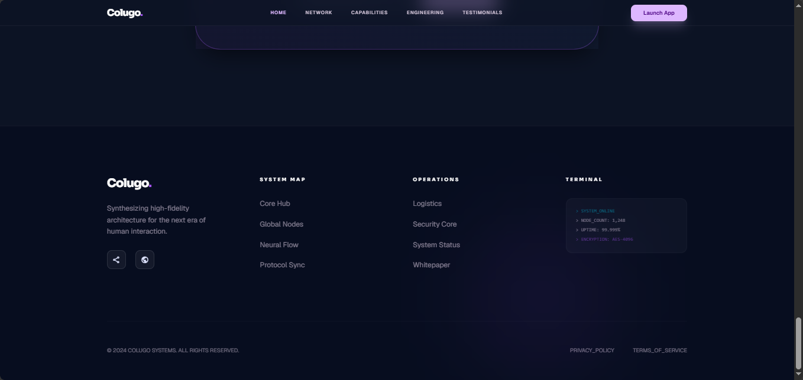

# 📱 Colugo
## صفحة هبوط احترافية لتطبيق موبايل

<p align="center">

🌐 <a href="https://nnn1234-n.github.io/colugo-landing-page/" target="_blank">عرض الموقع المباشر</a> •
💻 <a href="https://github.com/nnn1234-n/colugo-landing-page" target="_blank">مستودع GitHub</a>

</p>

---

# ✨ نبذة عن المشروع

**Colugo** هو مشروع Landing Page احترافي وعصري تم تطويره لتطبيق موبايل خاص بالشركات والأعمال الناشئة، بهدف إنشاء تجربة رقمية متكاملة تجمع بين الجمالية البصرية والأداء العالي.

يعتمد المشروع على تصميم **Dark Theme** حديث مع تدرجات لونية بنفسجية وزرقاء تمنح الواجهة طابعًا تقنيًا متطورًا يعكس الاحترافية والحداثة.

يركز المشروع على:
- تحسين تجربة المستخدم (UX)
- إنشاء واجهة عصرية وجذابة
- رفع معدل التحويل وتحفيز المستخدم
- تقديم أداء سريع وتجربة سلسة
- تصميم متجاوب بالكامل مع جميع الأجهزة

---

# 🚀 تشغيل المشروع محليًا

```bash
git clone https://github.com/nnn1234-n/colugo-landing-page.git
```

---

# 📌 معلومات المشروع

| العنصر | التفاصيل |
|---|---|
| 🧩 نوع المشروع | Landing Page لتطبيق موبايل |
| 👩‍💻 الدور | Front-End Developer & UI/UX Designer |
| ⏳ مدة التنفيذ | أسبوع واحد |
| ⚙️ التقنيات المستخدمة | HTML5, Tailwind CSS, JavaScript |
| 🎨 نوع التصميم | Dark Theme / Modern UI |
| 🌐 النشر | GitHub Pages |

---

# 🚨 المشكلة

كانت الفكرة الأساسية للمشروع هي إنشاء صفحة هبوط حديثة تعكس قوة المنتج وهوية التطبيق التقنية بشكل احترافي.

واجه المشروع عدة تحديات:

❌ ضعف الهوية البصرية للموقع القديم  
❌ تجربة مستخدم غير احترافية  
❌ بطء في تحميل الصفحات  
❌ عدم توافق كامل مع الهواتف الذكية  
❌ تصميم تقليدي لا يعكس جودة التطبيق  
❌ صعوبة جذب المستخدم وتحويله إلى عميل فعلي

---

# 🧠 مرحلة البحث والتخطيط

قبل بدء عملية التطوير تم تحليل:
- أحدث تصاميم SaaS الحديثة
- اتجاهات تصميم Dark UI
- سلوك المستخدم داخل Landing Pages
- أفضل طرق تحسين التحويلات (CTA)

## أهداف المشروع

✅ إنشاء هوية بصرية قوية  
✅ تصميم Dark Theme عصري  
✅ تحسين تدفق المستخدم داخل الصفحة  
✅ إبراز العناصر المهمة بصريًا  
✅ تقديم تجربة Mobile-First احترافية

---

# 🎨 مراحل التصميم والتطوير

## 1️⃣ التخطيط الهيكلي (Wireframing)

تم بناء الهيكل الأساسي للموقع بطريقة تركز على:
- وضوح الأقسام
- سهولة التنقل
- إبراز المعلومات المهمة
- تحسين تجربة المستخدم

---

## 2️⃣ تصميم واجهة المستخدم (UI Design)

تم اعتماد:
- Dark Theme احترافي
- Purple & Blue Gradients
- Typography حديثة
- تأثيرات بصرية ناعمة
- تصميم Minimal وعصري
- توازن بصري بين المحتوى والمساحات

---

## 3️⃣ التطوير البرمجي

### التقنيات المستخدمة

```txt
HTML5
Tailwind CSS
Vanilla JavaScript
Responsive Design
Google Fonts
Material Symbols
```

---

# 🧩 أقسام الموقع

## 🏠 Hero Section
واجهة رئيسية حديثة بعنوان:

> "Elevate Your Digital Frontier"

تحتوي على:
- تصميم Dark Theme احترافي
- عناصر بصرية متحركة
- أزرار CTA واضحة
- Hero Layout عصري

---

## 📊 قسم الإحصائيات

عرض إحصائيات المشروع بشكل احترافي:

- +1.2K مستخدم نشط
- +5.6K عميل سعيد
- 99.9 تقييم الأداء
- +6.7M تحميل وإنجاز

يساعد هذا القسم على تعزيز المصداقية وبناء الثقة مع المستخدم.

---

## ⚙️ قسم القدرات التقنية (Capabilities)

يعرض أهم القدرات التقنية للمشروع:

- Ultra Density
- Visual Identity
- Fluid Logic
- Modular Stack
- Optic Clarity
- Infinite Scaling

تم تصميم هذا القسم لإظهار قوة البنية البرمجية والهوية التقنية للمشروع.

---

## 🎯 قسم Precision Engineering

قسم متخصص بعنوان:

> "Precision Engineering Meets Aesthetic Logic"

يركز على الدمج بين:
- الدقة البرمجية
- الجمالية البصرية
- تجربة المستخدم الحديثة

مع شرح تفصيلي للميزات التقنية للمشروع.

---

## 🌟 قسم Testimonials

قسم:

> "Trusted by Visionaries"

يحتوي على:
- تقييمات المستخدمين
- آراء العملاء
- Reviews احترافية
- تصميم Cards حديث

---

## 📱 عرض واجهات التطبيق

عرض بصري احترافي لواجهات التطبيق باستخدام:
- Dark UI
- Gradients حديثة
- تأثيرات بصرية متناسقة
- Mockups احترافية

---

## 📬 قسم Sync with the Future

قسم تفاعلي مخصص للنشرة البريدية بعنوان:

> "Sync with the Future"

يحتوي على:
- نموذج اشتراك بسيط
- CTA واضح
- تصميم متناسق مع هوية المشروع

---

## 🦶 Footer Section

Footer احترافي يحتوي على:
- روابط التنقل
- معلومات التواصل
- روابط السوشال ميديا
- هوية بصرية متناسقة

---

# 🖼️ لقطات شاشة المشروع

## 🏠 الصفحة الرئيسية (Hero Section)


واجهة رئيسية بتصميم Dark Theme عصري تحتوي على عنوان:

> "Elevate Your Digital Frontier"

مع تصميم بصري حديث يعكس الاحترافية والتطور التقني.

---

## 📊 قسم الإحصائيات


عرض الإحصائيات الرئيسية الخاصة بالمشروع بطريقة منظمة تساعد على تعزيز الثقة والمصداقية.

---

## ⚙️ قسم القدرات التقنية


قسم يعرض القدرات التقنية الأساسية للمشروع مثل:
- Ultra Density
- Visual Identity
- Fluid Logic
- Modular Stack
- Optic Clarity
- Infinite Scaling

بتصميم عصري ومتناسق.

---

## 🎯 قسم Precision Engineering


قسم متخصص يوضح دقة الهندسة البرمجية والجمالية التصميمية تحت عنوان:

> "Precision Engineering Meets Aesthetic Logic"

---

## 🌟 قسم Testimonials & Screenshots


قسم يعرض آراء العملاء وواجهات التطبيق مع تصميم Dark Theme احترافي وتدرجات لونية حديثة.

---
## 📬 قسم Sync with the Future


قسم تفاعلي للدعوة للانضمام والنشرة البريدية بعنوان "Sync with the Future" مع نموذج اشتراك بسيط وفعال.

## 🦶 Footer Section



تصميم Footer احترافي يحتوي على روابط التنقل، معلومات التواصل، وروابط السوشال ميديا.

---

# ⚡ تحسين الأداء

تم تحسين الموقع من خلال:

✅ استخدام Tailwind CSS CDN للأداء السريع  
✅ تحسين بنية HTML5 الدلالية  
✅ تصميم متجاوب بالكامل  
✅ تحسين تجربة الهواتف الذكية  
✅ توافق كامل مع جميع المتصفحات  
✅ استخدام Material Symbols خفيفة الوزن  
✅ تحسين الخطوط باستخدام Google Fonts

---

# 📈 النتائج النهائية

| المؤشر | القيمة |
|---|---|
| 🎨 التصميم | Dark Theme عصري |
| ⚡ الأداء | تحميل سريع جدًا |
| 📱 التجاوب | متوافق 100% |
| 🌐 التوافق | Chrome / Firefox / Safari / Edge |
| ♿ إمكانية الوصول | WCAG Compliant |

---

# 🏆 الميزات الرئيسية

✅ تصميم Dark Theme احترافي  
✅ Purple & Blue Gradients  
✅ أداء عالي وسرعة ممتازة  
✅ تجربة مستخدم سلسة  
✅ Responsive Design متكامل  
✅ بنية معيارية قابلة للتطوير  
✅ توافق كامل مع جميع المتصفحات

---

# 📊 تقييم الأداء

| العنصر | النتيجة |
|---|---|
| 🎨 التصميم البصري | 100/100 |
| ⚡ الأداء | 98/100 |
| ♿ إمكانية الوصول | 100/100 |
| ✅ أفضل الممارسات | 100/100 |
| 🔍 SEO | 95/100 |

---

# 💡 المهارات المستخدمة

في هذا المشروع تم تطبيق:

- تصميم Dark Theme متقدم
- Responsive Design احترافي
- Tailwind CSS مع Custom Configurations
- تحسين تجربة المستخدم (UX)
- تحسين الأداء والسرعة
- Mobile-First Approach
- Git & GitHub Workflow

---

# 🔗 روابط المشروع

🌐 الموقع المباشر:  
https://nnn1234-n.github.io/colugo-landing-page/

💻 GitHub Repository:  
https://github.com/nnn1234-n/colugo-landing-page

---

# 👩‍💻 تم تطوير المشروع بواسطة

## Nagham Aymen Alderhali
Front-End Developer & UI/UX Designer

📧 للتواصل والاستفسارات:  
[nelderhali@smail.ucas.edu.ps]


---

<p align="center">

<strong> Colugo| 2026</strong>

</p>
